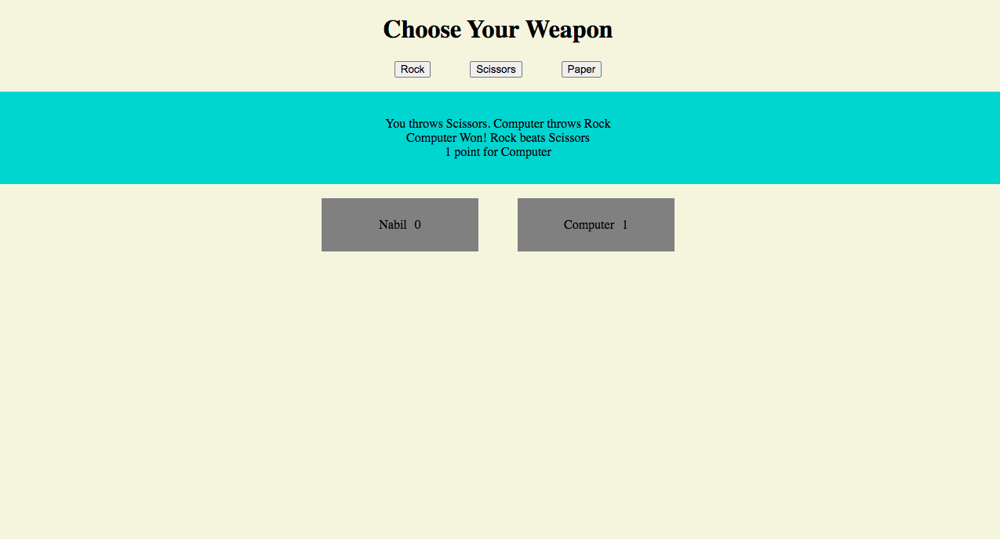

# Rock, Paper & Scissors
> Program a Rock, Paper & Scissors game. It's a game that we used to play when we are little kids. Good times :).
> Live demo [_here_](https://nabelk.github.io/rock-paper-scissors/).

## Table of Contents
* [General Info](#general-information)
* [Technologies Used](#technologies-used)
* [Features](#features)
* [Screenshots](#screenshots)
* [Room for Improvement](#room-for-improvement)
* [Contact](#contact)

## General Information
- This project is a part of The Odin Project:Foundations course.
- It's a straight-up Rock, Paper & Scissors game of a user vs computer.
- The script that been written to determine who's the winner for each of rounds.
- Next, the purpose of the game is to play a 5 rounds (phase 1) and then, who get the first 5 points (phase 2)
- Why did you undertake it? To get used of js fundamentals that has been learned so far.
- Phase 1: Creating a script without any UI, just using prompt and alert. (branch:main)
- Phase 2: Adding an interactive UI to the script. (branch:rps-ui)

## Technologies Used
- HTML
- CSS
- Javascript & Vanilla js

## Screenshots

## Room for Improvement

Room for improvement:
- Better UI and UX.

## Contact
Created by [@nabelk](https://www.linkedin.com/in/nabil-khalid-36791a241/) - feel free to contact me!